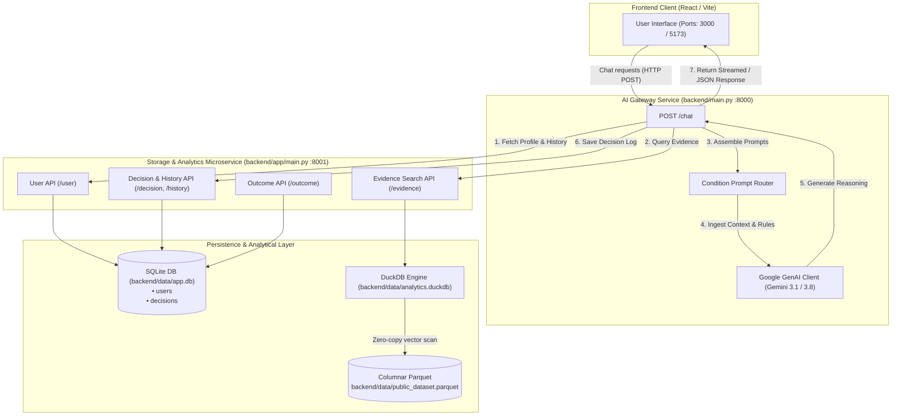
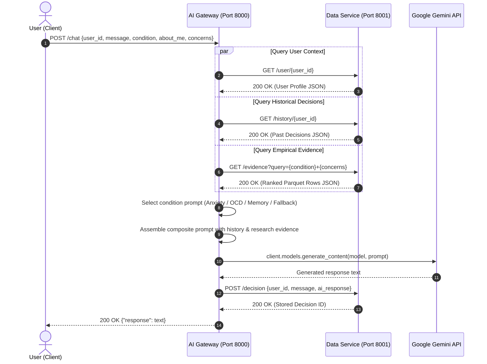
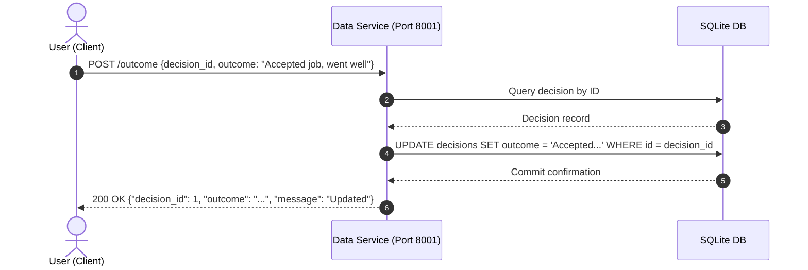
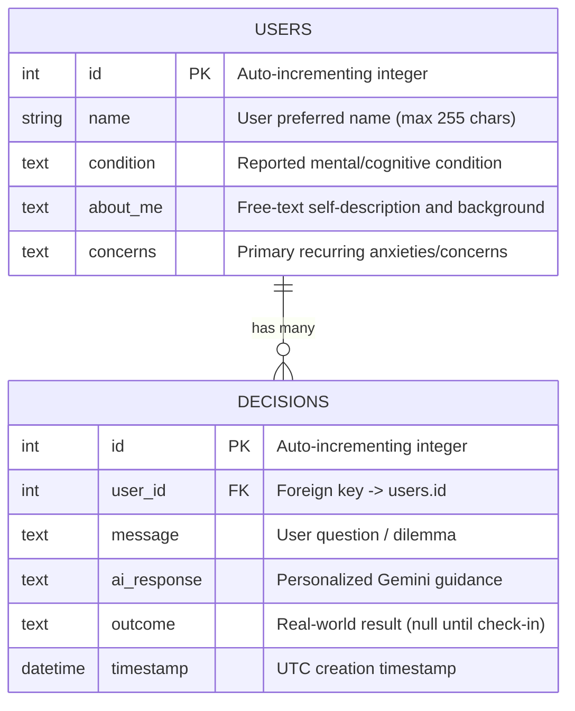
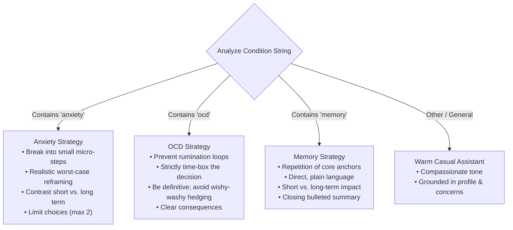

# System Architecture

## Project: Make Up Your Mind
**Document Version:** 1.0.0  
**Target Audience:** Software Engineers, System Architects, Contributors

---

## 1. High-Level System Architecture

**Make Up Your Mind** is built upon a **decoupled microservice architecture** that cleanly separates AI model orchestration and condition-specific prompt engineering from persistent storage and analytical processing.



---

## 2. Service Separation & Network Topology

| Component | Host / Port | Entrypoint | Primary Responsibilities |
| :--- | :--- | :--- | :--- |
| **Frontend Client** | `localhost:3000` or `localhost:5173` | React Application | Chat interface, condition selector, decision timeline, outcome update modals. |
| **AI Gateway Service** | `localhost:8000` | [`backend/main.py`](file:///C:/Users/sunru/Desktop/TAMU/sunnyprojects/make-up-your-mind/backend/main.py) | Ingests chat requests, dispatches condition-specific prompts, communicates with Google Gemini API, coordinates persistence. |
| **Database & Analytics Service** | `localhost:8001` | [`backend/app/main.py`](file:///C:/Users/sunru/Desktop/TAMU/sunnyprojects/make-up-your-mind/backend/app/main.py) | Point-in-time CRUD operations for users and decision records, DuckDB-powered search over columnar Parquet datasets. |

### Inter-Service Communication
* All internal service communication occurs over standard HTTP REST interfaces.
* The AI Gateway connects to the Database Service using `DB_BASE_URL` (default: `http://localhost:8001`), with configurable timeouts (`DATABASE_TIMEOUT_SECONDS = 10`).
* Fail-safe design: If the analytical evidence retrieval endpoint (`GET /evidence`) fails or times out, the AI Gateway logs a silent fallback to `[]` evidence, guaranteeing uninterrupted conversational flow for the user.

---

## 3. Data Flow & Interaction Lifecycle

### 3.1 Decision Conversation Flow (`POST /chat`)



---

### 3.2 Decision Outcome Check-In Flow (`POST /outcome`)



---

## 4. Storage & Persistence Layer Design

### 4.1 Relational Data Model (SQLite)

Relational entities are defined using SQLAlchemy declarative models in [`backend/app/models.py`](file:///C:/Users/sunru/Desktop/TAMU/sunnyprojects/make-up-your-mind/backend/app/models.py).



#### Key Database Invariants:
1. **Foreign Key Integrity**: Enforced explicitly on every SQLite connection using `PRAGMA foreign_keys=ON` via SQLAlchemy's connect event listener in [`backend/app/database.py`](file:///C:/Users/sunru/Desktop/TAMU/sunnyprojects/make-up-your-mind/backend/app/database.py#L32-L37).
2. **Compound Index**: Index `ix_decisions_user_timestamp` on `(user_id, timestamp)` guarantees $O(\log n)$ performance when fetching chronological decision histories for a user.
3. **Zero-Data-Loss Dynamic Migration**: [`init_db`](file:///C:/Users/sunru/Desktop/TAMU/sunnyprojects/make-up-your-mind/backend/app/database.py#L93-L110) inspects `PRAGMA table_info` columns at runtime. If older schemas exist (e.g. from prototype versions), [`_rebuild_tables`](file:///C:/Users/sunru/Desktop/TAMU/sunnyprojects/make-up-your-mind/backend/app/database.py#L47-L91) safely renames existing tables, generates the new schema, maps data fields, drops legacy tables, and reconstructs foreign key relationships without altering user or decision primary keys.

---

### 4.2 Analytical Evidence Engine (DuckDB + Parquet)

Rather than maintaining heavy external vector databases or Elasticsearch clusters, analytical and benchmark evidence queries are executed natively using an embedded **DuckDB** instance over columnar **Parquet** files:

```
backend/data/
├── analytics.duckdb            <-- DuckDB local database catalog
├── public_dataset.parquet      <-- Columnar dataset containing research benchmarks
└── parquet/                    <-- Target directory for dynamic analytic exports
```

#### Keyword Scoring Algorithm:
1. The user's search query (derived from condition and concerns) is tokenized with regex `[a-z0-9]+`.
2. High-frequency English stop words (e.g., *should, what, if, would, could, have*) are pruned out.
3. DuckDB evaluates a vectorized query unnesting the remaining terms against the tokenized fields of [`public_dataset.parquet`](file:///C:/Users/sunru/Desktop/TAMU/sunnyprojects/make-up-your-mind/backend/app/duckdb_service.py#L100-L118):
```sql
WITH terms AS (SELECT unnest(?::VARCHAR[]) AS term),
matches AS (
    SELECT id, title, category, summary, keywords, count(*) AS score
    FROM read_parquet(?) CROSS JOIN terms
    WHERE list_contains(
        regexp_extract_all(lower(concat_ws(' ', title, summary, keywords)), '[a-z0-9]+'),
        term
    )
    GROUP BY id, title, category, summary, keywords
)
SELECT id, title, category, summary, keywords
FROM matches
ORDER BY score DESC, id
LIMIT ?;
```
4. Returns source tags in the format `<filename>#<id>` for citations.

---

## 5. Cognitive Prompt Engineering Framework

The AI Gateway implements condition-tailored cognitive design patterns located in [`backend/prompts/`](file:///C:/Users/sunru/Desktop/TAMU/sunnyprojects/make-up-your-mind/backend/prompts/):

```
backend/prompts/
├── anxiety.py    --> get_anxiety_prompt(about_me, concerns, message)
├── memory.py     --> get_memory_prompt(about_me, concerns, message)
└── ocd.py        --> get_ocd_prompt(about_me, concerns, message)
```

### Strategy Matrix



---

## 6. Directory Structure & Module Responsibilities

```
make-up-your-mind/
├── PRD.md                        # Product Requirements Document
├── Architecture.md               # This Architecture Specification
├── API.md                        # Complete REST API Reference
├── LICENSE                       # MIT License
├── .gitignore                    # Root Git ignore rules
│
└── backend/                      # Standalone Backend Service Directory
    ├── .env.example              # Sample environment configuration
    ├── requirements.txt          # Python runtime dependencies
    ├── README.md                 # Backend-specific quickstart & test guide
    ├── main.py                   # AI Gateway Service (FastAPI on Port 8000)
    │
    ├── app/                      # Database & Analytical Microservice (Port 8001)
    │   ├── __init__.py
    │   ├── config.py             # Path resolution and environment variables
    │   ├── database.py           # SQLite connection pool, FKs, auto-migration
    │   ├── duckdb_service.py     # DuckDB Parquet storage & keyword search
    │   ├── models.py             # SQLAlchemy User and Decision ORM models
    │   ├── schemas.py            # Pydantic v2 schemas and validation
    │   └── main.py               # Database Service FastAPI application
    │
    ├── prompts/                  # Cognitive behavioral prompt templates
    │   ├── anxiety.py            # Anti-catastrophizing & micro-step templates
    │   ├── memory.py             # Repetition & structured summary templates
    │   └── ocd.py                # Time-boxing & anti-rumination templates
    │
    ├── tests/                    # Pytest Automated Test Suite
    │   ├── conftest.py           # In-memory / temporary test fixtures
    │   ├── test_app.py           # REST API contracts & validation tests
    │   └── test_data_layer.py    # Constraints, persistence & DuckDB tests
    │
    └── data/                     # Local data stores (ignored by Git)
        ├── .gitignore
        ├── app.db                # SQLite user & decision database
        ├── analytics.duckdb      # DuckDB local catalog
        └── public_dataset.parquet# Empirical reference dataset
```

---

## 7. Security, Reliability & Operational Best Practices

1. **Secret Isolation**: `GEMINI_API_KEY` is loaded exclusively from `.env` inside `backend/` and never written to logs or committed to Git.
2. **Strict Sanitization**: Pydantic v2 schemas employ `str_strip_whitespace=True` to reject invisible whitespace payloads and ensure clean data persistence.
3. **CORS Governance**: Configured to restrict origin access to verified React dev ports (`http://localhost:3000`, `http://localhost:5173`) while permitting standard HTTP verbs.
4. **Resilient Startup Lifecycle**: Both services initialize their tables and verify baseline parquet datasets during the FastAPI `lifespan` startup phase, preventing race conditions on first request.
